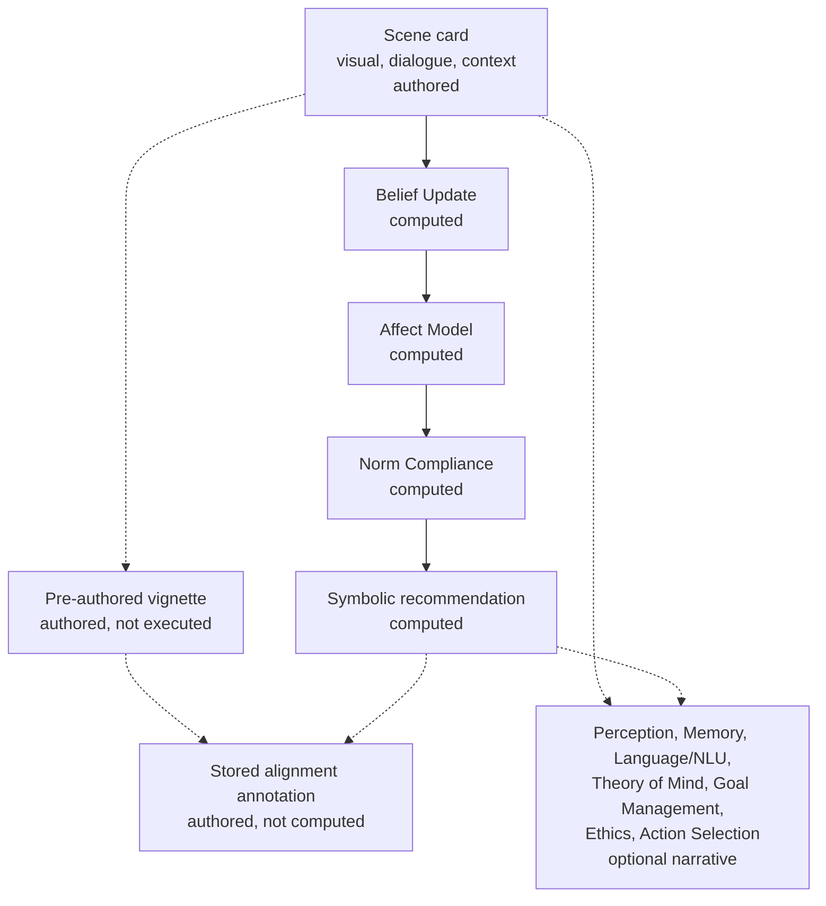

# Architecture

The paper’s inward–outward comparison uses the deterministic symbolic pathway. Language-model text is a separate, optional narrative. It is not the symbolic recommendation and it is not an alignment label.

Solid arrows are the reproduction path. Dotted arrows are authored records or optional narrative. The narrative branch cannot write back into the recommendation.

## What is computed

`runSymbolicPathway` calls, in order:

1. `runBeliefEngine` on the three input fields joined for matching.
2. `runAffectEngine` on the observations just produced.
3. `runNormEngine` on those observations, the beliefs, and the affect state.

Each call allocates its own result. The next scenario does not receive the previous `SharedState`.

## What is authored

- Scene-card text.
- The 23 norms, observation patterns, appraisal deltas, causal-claim table, and candidate rules.
- Pre-authored vignettes.
- Alignment labels.
- Source-relation tiers in `NovelFidelity.jsx`.

## What the original app did with the LLM

`runPipeline` in the export computed the three engines first, then awaited `base44.integrations.Core.InvokeLLM`, then displayed the model’s stage strings. It stored the engine result on `result._symbolic` and did not copy the model’s action onto `recommended_action`. The model was told not to contradict the symbolic context. That instruction is not a guarantee, and it is also not a feedback loop: the recommendation had already been chosen.

Action Selection is one of the seven narrative stages. The published symbolic recommendation is the norm engine’s top surviving candidate.

## Stage ids

| # | Name | Id in code | Pathway |
|---|---|---|---|
| 1 | Perception | perception | narrative |
| 2 | Belief Update | belief | symbolic |
| 3 | Memory | memory | narrative |
| 4 | Language/NLU | language | narrative |
| 5 | Theory of Mind | tom | narrative |
| 6 | Affect Model | emotion | symbolic |
| 7 | Goal Management | goals | narrative |
| 8 | Ethics Module | ethics | narrative |
| 9 | Norm Compliance | norms | symbolic |
| 10 | Action Selection | action | narrative |

The Affect Model’s id is `emotion`. The recommendation is still produced in Norm Compliance, not in Action Selection.
